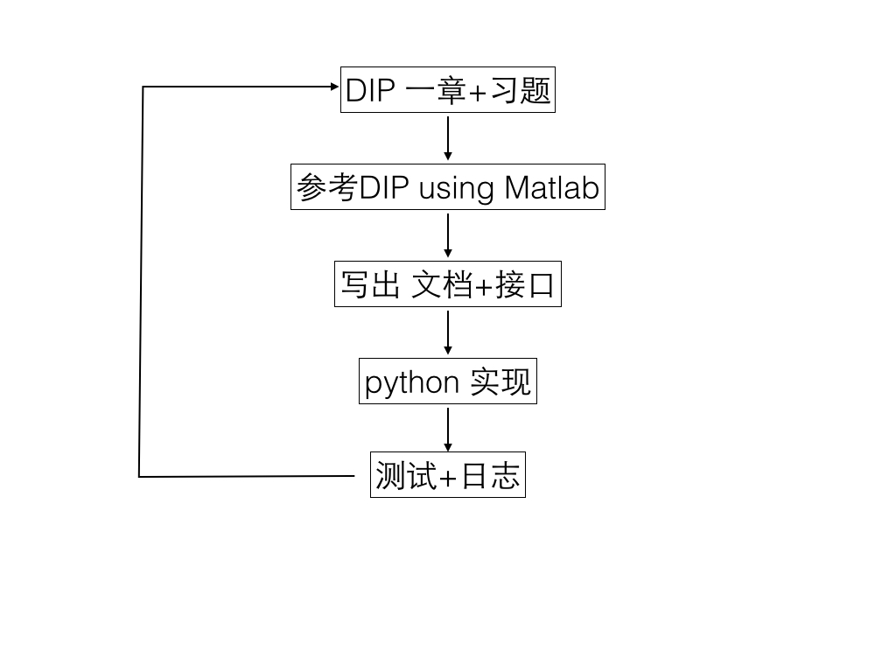

# 一起来造DIP轮子吧

DIP即 Digital Image Processing。顾名思义，让我们一起来从基础开始构建数字图像处理的函数库吧。

## 说明
### 参考资料
1. Digital Image Processing 3e
2. Digital Image Processing using Matlab
3. opencv documents

### 轮子内容
1. DIP一书中所涉及道德方法和操作
2. 自己感兴趣的图像处理的相关操作

### 技术标准
1. 可以使用python的各种科学库，但不包括CV2
2. 给出合适的文档（English）
3. 除了 读入、显示、储存图像外，不能使用python的内建图像库

### 工作流程

### 工作安排
每周实现一章：
- 周一、周二：DIP书+习题
- 周三：参考 matlab 写文档和接口
- 周四、周五：python实现
- 周末：测试，日志，翻译，更新文章
以上 3~11章，共计9周。预计完成时间12.26